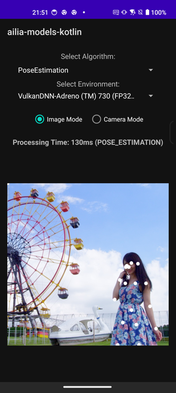
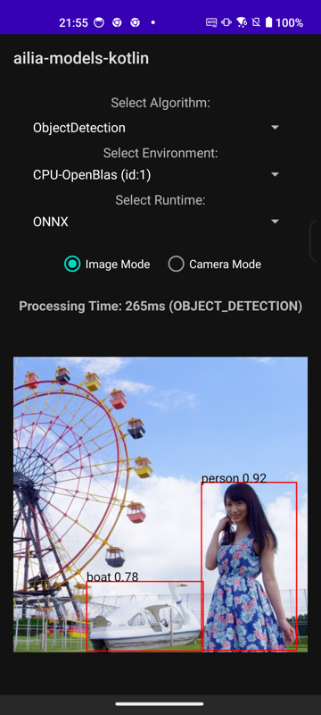
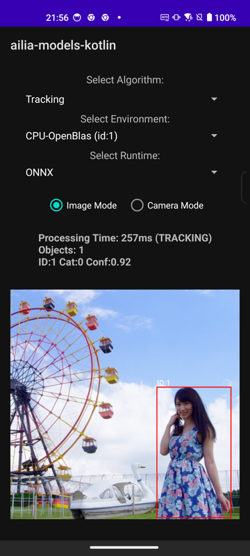
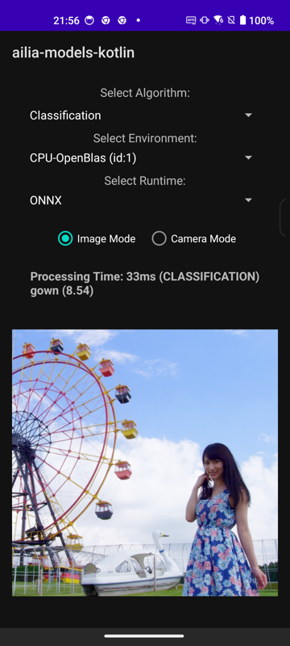
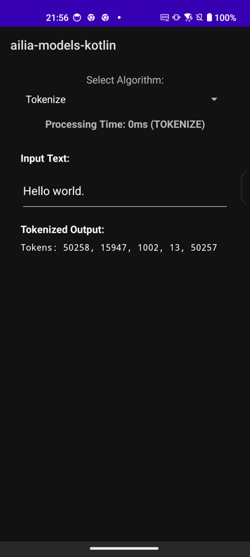
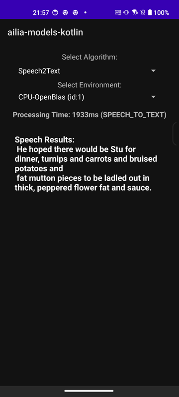
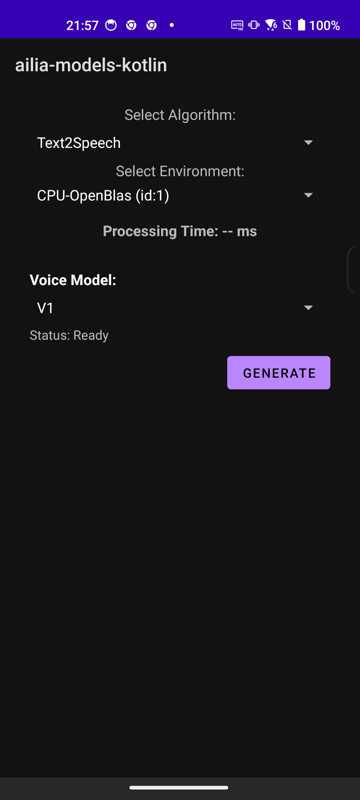
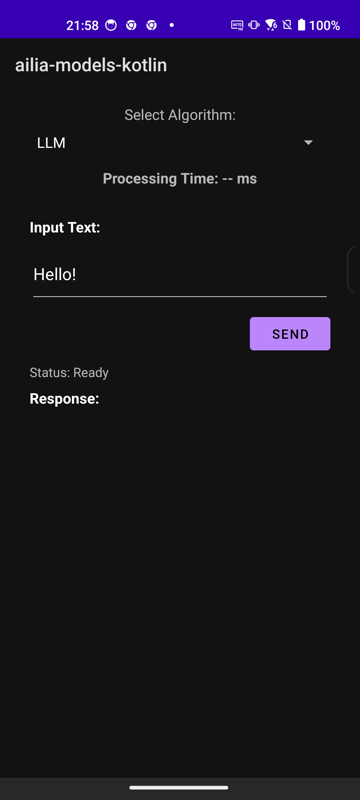
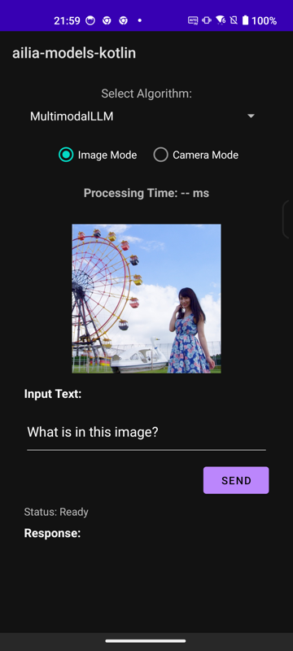

# ailia MODELS Kotlin

Demo project of ailia SDK with Android Studio (Kotlin)

## Test environment

- macOS 12.1 / Windows 11
- Android Studio 2025.1.3
- Gradle 8.13.2
- Kotlin 1.8.22
- ailia SDK 1.5.0

## Setup

Download dependent libraries via submodule.

```
git submodule init
git submodule update
```

## Supported models

|Category|Model|SDK|
|-----|-----|-----|
|Pose Estimation|[Light Weight Human Pose Estimation](app/src/main/java/jp/axinc/ailia_kotlin/AiliaPoseEstimatorSample.kt)|ailia SDK (ONNX)|
|Object Detection|[YOLOX (TFLite)](app/src/main/java/jp/axinc/ailia_kotlin/AiliaTFLiteObjectDetectionSample.kt) / [YOLOX (ONNX)](app/src/main/java/jp/axinc/ailia_kotlin/AiliaOnnxObjectDetectionSample.kt)|ailia TFLite Runtime / ailia SDK (ONNX)|
|Object Tracking|[ByteTrack](app/src/main/java/jp/axinc/ailia_kotlin/AiliaTrackerSample.kt)|ailia TFLite Runtime / ailia SDK (ONNX) + ailia Tracker|
|Image Classification|[MobileNetV2 (TFLite)](app/src/main/java/jp/axinc/ailia_kotlin/AiliaTFLiteClassificationSample.kt) / [MobileNetV2 (ONNX)](app/src/main/java/jp/axinc/ailia_kotlin/AiliaOnnxClassificationSample.kt)|ailia TFLite Runtime / ailia SDK (ONNX)|
|Tokenizer|[Whisper Tokenizer](app/src/main/java/jp/axinc/ailia_kotlin/AiliaTokenizerSample.kt)|ailia Tokenizer|
|Speech to Text|[Whisper](app/src/main/java/jp/axinc/ailia_kotlin/AiliaSpeechSample.kt) / [SenseVoice](app/src/main/java/jp/axinc/ailia_kotlin/AiliaSpeechSample.kt)|ailia AI Speech|
|Text to Speech|[GPT-SoVITS](app/src/main/java/jp/axinc/ailia_kotlin/AiliaVoiceSample.kt)|ailia AI Voice|
|LLM|[Gemma 2 2B](app/src/main/java/jp/axinc/ailia_kotlin/AiliaLLMSample.kt)|ailia LLM|
|Multimodal LLM|[Gemma 3 4B](app/src/main/java/jp/axinc/ailia_kotlin/AiliaMultimodalLLMSample.kt)|ailia LLM|

## Screenshots

| | | |
|:---:|:---:|:---:|
|Pose Estimation|Object Detection|Tracking|
||||
|Classification|Tokenizer|Speech to Text|
||||
|Text to Speech|LLM|Multimodal LLM|
||||
