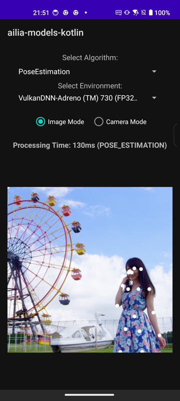
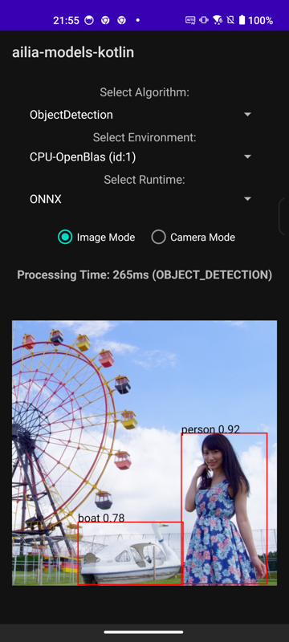
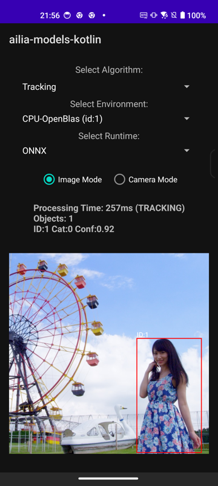
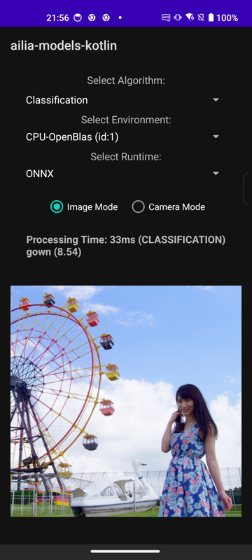
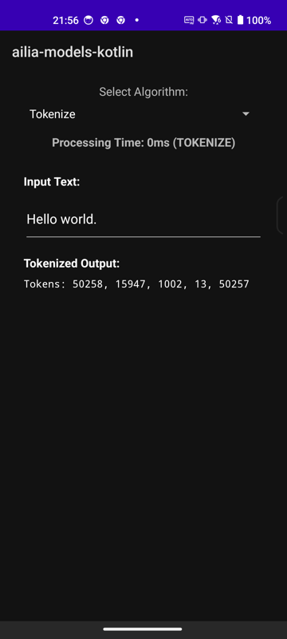
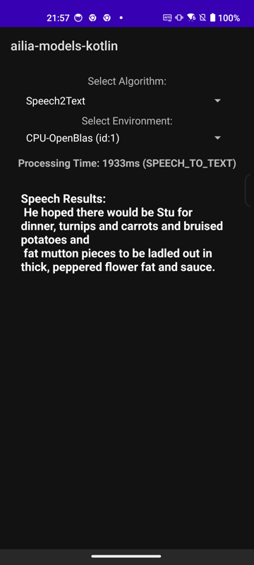
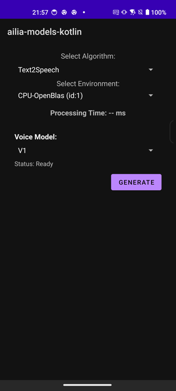
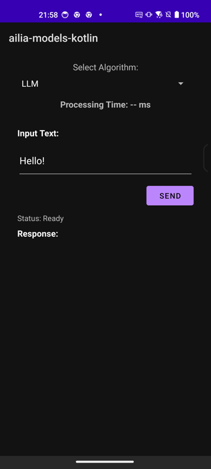
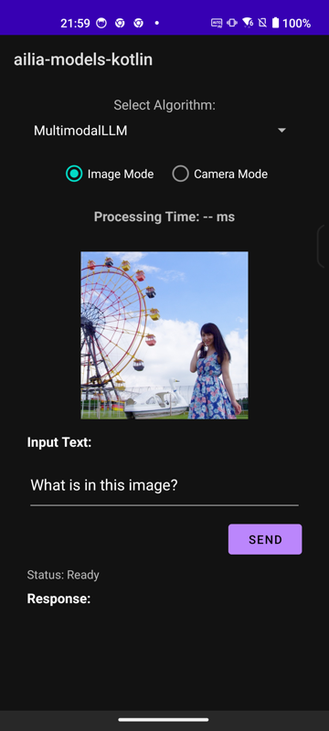

# ailia MODELS Kotlin

Android Studio sample collection for running ailia SDK models from Kotlin. Each `Ailia*Sample.kt` keeps model download, preprocessing, inference, postprocessing, and resource release close together so one model can be copied into another application without bringing `MainActivity` with it.

## Test environment

- macOS / Windows 11
- Android Studio 2025.1.3
- Gradle 8.13.2
- Kotlin 1.8.22
- minSdk 21 / targetSdk 35
- ailia SDK 1.5.0

## Setup

Fetch the JNI modules, then open the repository root in Android Studio.

```shell
git submodule update --init --recursive
```

Models bundled in `res/raw` run without a download. Other models are downloaded when Run, Record, Generate, or Send is pressed and are stored in the application's durable model directory. A progress bar is shown while a transfer is active.

## Supported models

| Category | Model sample | Runtime |
| --- | --- | --- |
| Pose Estimation | [Lightweight Human Pose Estimation](app/src/main/java/jp/axinc/ailia_kotlin/AiliaPoseEstimatorSample.kt) | ailia SDK |
| Object Detection | [YOLOX TFLite](app/src/main/java/jp/axinc/ailia_kotlin/AiliaTFLiteObjectDetectionSample.kt), [YOLOX ONNX](app/src/main/java/jp/axinc/ailia_kotlin/AiliaOnnxObjectDetectionSample.kt), [DETR ResNet50](app/src/main/java/jp/axinc/ailia_kotlin/AiliaDetrSample.kt) | ailia TFLite Runtime / ailia SDK |
| Object Tracking | [ByteTrack](app/src/main/java/jp/axinc/ailia_kotlin/AiliaTrackerSample.kt) with YOLOX | ailia Tracker + detector runtime |
| Image Classification | [MobileNetV2 / ResNet50 TFLite](app/src/main/java/jp/axinc/ailia_kotlin/AiliaTFLiteClassificationSample.kt), [MobileNetV2 / ResNet50 / ViT-B/16 ONNX](app/src/main/java/jp/axinc/ailia_kotlin/AiliaOnnxClassificationSample.kt) | ailia TFLite Runtime / ailia SDK |
| Background Removal | [U-2-Net](app/src/main/java/jp/axinc/ailia_kotlin/AiliaU2NetSample.kt) | ailia SDK |
| Zero-Shot Classification | [multilingual-MiniLMv2 L12](app/src/main/java/jp/axinc/ailia_kotlin/AiliaMiniLMv2Sample.kt) | ailia Tokenizer + ailia SDK |
| Speech to Text | [Whisper / SenseVoice Small](app/src/main/java/jp/axinc/ailia_kotlin/AiliaSpeechSample.kt) | ailia AI Speech |
| Speaker Verification | [WeSpeaker ResNet34 (VoxCeleb) + Silero VAD v6](app/src/main/java/jp/axinc/ailia_kotlin/AiliaWeSpeakerSample.kt) | ailia SDK |
| Voice Filtering | [VoiceFilter + dynamic d-vector embedder + Silero VAD v6](app/src/main/java/jp/axinc/ailia_kotlin/AiliaVoiceFilterSample.kt) | ailia SDK |
| Text to Speech | [GPT-SoVITS V1 / V2 / V3 / V2-Pro / V2-Pro Distill (Small / Base)](app/src/main/java/jp/axinc/ailia_kotlin/AiliaVoiceSample.kt) | ailia AI Voice |
| LLM | [Gemma 4 E2B / E4B / Gemma 2 2B](app/src/main/java/jp/axinc/ailia_kotlin/AiliaLLMSample.kt) | ailia LLM (CPU / QNN) |
| Multimodal LLM (VLM) | [Gemma 4 E2B + mmproj](app/src/main/java/jp/axinc/ailia_kotlin/AiliaMultimodalLLMSample.kt) | ailia LLM (CPU / QNN) |
| Audio LLM (ALM) | [Gemma 4 E2B + mmproj](app/src/main/java/jp/axinc/ailia_kotlin/AiliaMultimodalLLMSample.kt) | ailia LLM (CPU / QNN) |

## Running the LLM samples on the NPU (QNN)

The LLM / VLM / ALM samples can run Gemma 4 E2B on the Qualcomm NPU through the ailia LLM QNN backend.
The `CPU` / `QNN` selector next to the Send button defaults to `QNN (NPU) <soc>`, and that entry appears only when
[`AiliaLLM.getQNNModelName()`](ailia-llm-jni/src/main/kotlin/axip/ailia_llm/Ailiallm.kt) reports a SoC that has a
converted model (currently `sm8475` and `sm7635`, see
[QnnSupport.kt](app/src/main/java/jp/axinc/ailia_kotlin/QnnSupport.kt)); otherwise only `CPU` is offered.

QNN models are SoC specific and self contained: `gemma4-e2b-<soc>.qnn` holds the prefill/decode graphs and
`gemma4-e2b-<soc>-mmproj.qnn` holds the image / audio encoder used by the VLM and ALM samples. The context
length is fixed at conversion time, so the samples open them with `n_ctx = 0`.

The LLM sample also has a `2048 tok` button next to Send. It pastes an ailia introduction text taken from
[ailia.ai](https://ailia.ai/) ([ailia_intro.txt](app/src/main/res/raw/ailia_intro.txt)), trimmed with the model
tokenizer to 2048 tokens, and clears the chat history so the next Send measures the prefill of that text alone.
After generation the status line reports the measured prefill throughput (PPS) and decode throughput, for example
`Prefill 2065 tokens 259.45 tokens/s (7959 ms) / Decode 894 tokens 7.48 tokens/s`.

The ailia SDK QNN backend requires FP16 on the NPU. On SoCs without FP16 support the environment list shows
`This SoC QNN FP16 not supported` and the QNN entries cannot be selected. FP16 support does not follow the
Hexagon version (SM8550 supports it while SM7635 and SM8635 do not, although all three are v73), so
[QnnSupport.kt](app/src/main/java/jp/axinc/ailia_kotlin/QnnSupport.kt) carries the per-SoC list taken from the
QAIRT 2.47 SDK (`libPyBackendInfo`: `PyBackendInfo("HTP", soc).get_soc_info_subset().supportsFp16`).

## Copying one sample into an application

Add only the JNI modules needed by the selected sample.

| Sample | Required Gradle modules |
| --- | --- |
| ONNX vision, U-2-Net, DETR | `ailia-sdk-jni` |
| TFLite vision | `ailia-tflite-jni` |
| ByteTrack | `ailia-tracker-jni` plus the selected detector runtime |
| multilingual-MiniLMv2 | `ailia-sdk-jni`, `ailia-tokenizer-jni` |
| Whisper / SenseVoice | `ailia-speech-jni` |
| WeSpeaker + Silero VAD v6 | `ailia-sdk-jni` |
| VoiceFilter + Silero VAD v6 | `ailia-sdk-jni` |
| GPT-SoVITS | `ailia-voice-jni`, `ailia-audio-jni`, `ailia-sdk-jni` |
| Gemma text or multimodal | `ailia-llm-jni` |

For a downloadable model, also copy [ModelDownloader.kt](app/src/main/java/jp/axinc/ailia_kotlin/ModelDownloader.kt). It uses a temporary file, validates HTTP status and size, records a SHA-256 sidecar, and only then moves the model into place. The sample constructors require a model directory so storage ownership is explicit.

```kotlin
val modelDirectory = ModelDownloader.modelDirectory(context)
val sample = AiliaDetrSample(modelDirectory)

executor.execute {
    if (sample.downloadModel() && sample.initialize(environmentId)) {
        val inference = sample.detect(bitmap)
        val detections: List<DetectionResult> = inference?.value.orEmpty()
    }
}
```

Run native initialization, inference, and release on the same serial executor. Do not release a model from the UI thread while inference is active.

The inference-facing result classes are independent of the SDK wrappers:

- Detection and tracking: `DetectionResult.kt`, `ModelInferenceResult.kt`, `CocoLabels.kt`, and `CategoryColors.kt`
- Classification: `ClassificationResult.kt`, `ModelInferenceResult.kt`, and `ImageNetLabels.kt`
- Background removal: `ModelInferenceResult.kt` (`SegmentationMask`)
- Speaker verification: `SpeakerVerificationAudio.kt` and the session-only `SpeakerProfileStore.kt`
- Voice filtering: `VoiceFilterAudio.kt` and the session-only `SpeakerProfileStore.kt`

`detect`, `classify`, and `predictMask` return typed results without drawing. `drawDetections` and `drawMask` are optional Android renderers. The `process...` methods remain small compatibility wrappers used by the demo UI.

Models in `res/raw` must be copied with their sample. Downloaded filenames and URLs are declared beside each model enum or at the top of its sample class. `INTERNET` is required for those downloads; `CAMERA` and `RECORD_AUDIO` are requested only when the corresponding feature is used.

## Screenshots

| | | |
| :---: | :---: | :---: |
| Pose Estimation | Object Detection | Tracking |
|  |  |  |
| Classification | Zero-Shot Classification | Speech to Text |
|  |  |  |
| Text to Speech | LLM | Multimodal LLM |
|  |  |  |
